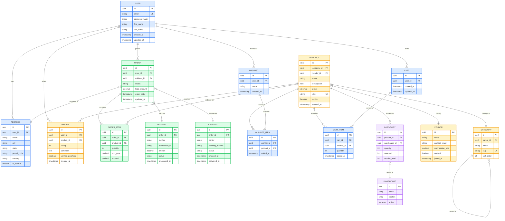

```mermaid
erDiagram
    classDef user fill:#dbeafe,stroke:#3b82f6
    classDef order fill:#dcfce7,stroke:#22c55e
    classDef product fill:#fef3c7,stroke:#f59e0b
    classDef inventory fill:#f3e8ff,stroke:#a855f7

    USER ||--o{ ORDER : places
    USER ||--o{ ADDRESS : has
    USER ||--o{ REVIEW : writes
    USER ||--o{ WISHLIST : maintains
    USER ||--o{ CART : owns

    ORDER ||--|{ ORDER_ITEM : contains
    ORDER }|--|| PAYMENT : "paid via"
    ORDER }|--|| SHIPPING : "shipped via"
    ORDER }|--|| ADDRESS : "delivered to"

    PRODUCT ||--o{ ORDER_ITEM : "ordered as"
    PRODUCT ||--o{ REVIEW : receives
    PRODUCT ||--o{ WISHLIST_ITEM : "added to"
    PRODUCT ||--o{ CART_ITEM : "added to"
    PRODUCT }|--|| CATEGORY : "belongs to"
    PRODUCT }|--|| VENDOR : "sold by"
    PRODUCT ||--o{ INVENTORY : "stocked in"

    CATEGORY ||--o{ CATEGORY : "parent of"

    WISHLIST ||--|{ WISHLIST_ITEM : contains
    CART ||--|{ CART_ITEM : contains

    INVENTORY }|--|| WAREHOUSE : "stored in"

    USER {
        uuid id PK
        string email UK
        string password_hash
        string first_name
        string last_name
        timestamp created_at
        timestamp updated_at
    }

    ORDER {
        uuid id PK
        uuid user_id FK
        uuid address_id FK
        string status
        decimal total_amount
        timestamp order_date
        timestamp updated_at
    }

    ORDER_ITEM {
        uuid id PK
        uuid order_id FK
        uuid product_id FK
        int quantity
        decimal unit_price
        decimal subtotal
    }

    PRODUCT {
        uuid id PK
        uuid category_id FK
        uuid vendor_id FK
        string name
        text description
        decimal price
        string sku UK
        boolean active
        timestamp created_at
    }

    CATEGORY {
        uuid id PK
        uuid parent_id FK
        string name
        string slug UK
        int sort_order
    }

    VENDOR {
        uuid id PK
        string name
        string contact_email
        decimal commission_rate
        boolean verified
        timestamp joined_at
    }

    ADDRESS {
        uuid id PK
        uuid user_id FK
        string street
        string city
        string state
        string postal_code
        string country
        boolean is_default
    }

    PAYMENT {
        uuid id PK
        uuid order_id FK
        string method
        string transaction_id
        decimal amount
        string status
        timestamp processed_at
    }

    SHIPPING {
        uuid id PK
        uuid order_id FK
        string carrier
        string tracking_number
        string status
        timestamp shipped_at
        timestamp delivered_at
    }

    REVIEW {
        uuid id PK
        uuid user_id FK
        uuid product_id FK
        int rating
        text comment
        boolean verified_purchase
        timestamp created_at
    }

    WISHLIST {
        uuid id PK
        uuid user_id FK
        string name
        timestamp created_at
    }

    WISHLIST_ITEM {
        uuid id PK
        uuid wishlist_id FK
        uuid product_id FK
        timestamp added_at
    }

    CART {
        uuid id PK
        uuid user_id FK
        timestamp created_at
        timestamp updated_at
    }

    CART_ITEM {
        uuid id PK
        uuid cart_id FK
        uuid product_id FK
        int quantity
        timestamp added_at
    }

    INVENTORY {
        uuid id PK
        uuid product_id FK
        uuid warehouse_id FK
        int quantity
        int reserved
        int reorder_level
    }

    WAREHOUSE {
        uuid id PK
        string name
        string location
        boolean active
    }

    USER:::user
    ADDRESS:::user
    CART:::user
    CART_ITEM:::user
    WISHLIST:::user
    WISHLIST_ITEM:::user

    ORDER:::order
    ORDER_ITEM:::order
    PAYMENT:::order
    SHIPPING:::order

    PRODUCT:::product
    CATEGORY:::product
    VENDOR:::product
    REVIEW:::product

    INVENTORY:::inventory
    WAREHOUSE:::inventory
```
