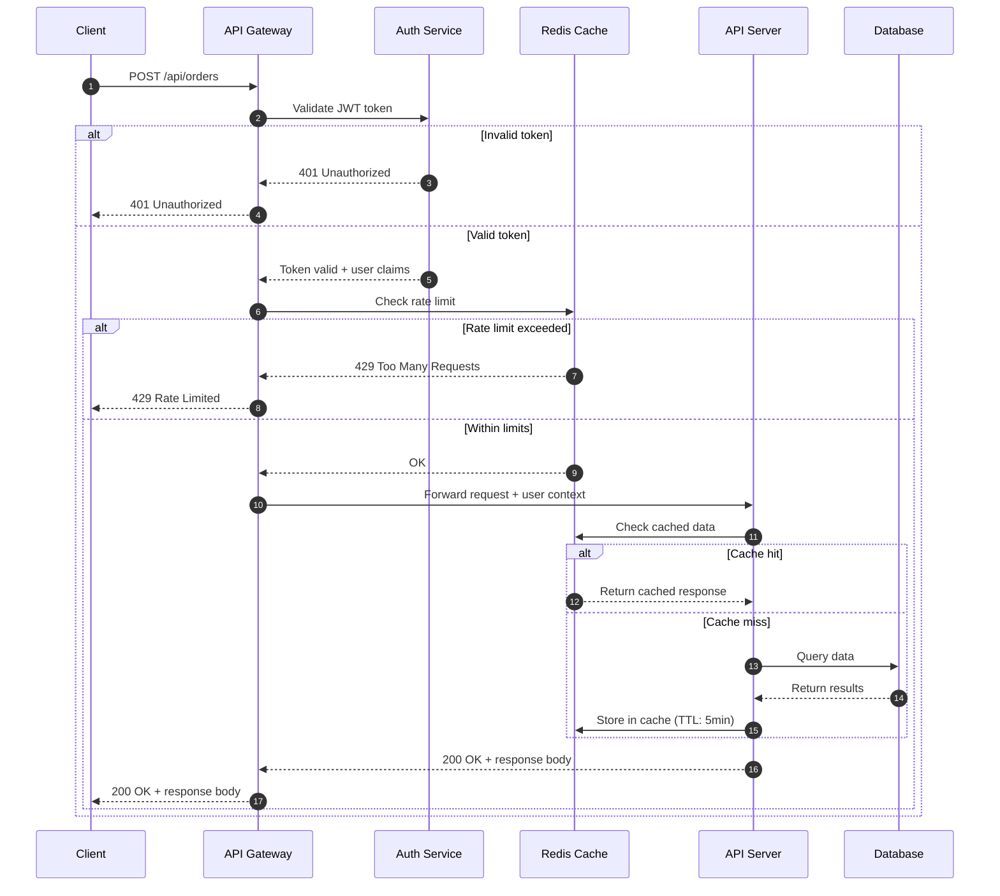

```mermaid
sequenceDiagram
    autonumber
    participant Client
    participant Gateway as API Gateway
    participant Auth as Auth Service
    participant Cache as Redis Cache
    participant API as API Server
    participant DB as Database

    Client->>Gateway: POST /api/orders
    Gateway->>Auth: Validate JWT token

    alt Invalid token
        Auth-->>Gateway: 401 Unauthorized
        Gateway-->>Client: 401 Unauthorized
    else Valid token
        Auth-->>Gateway: Token valid + user claims
        Gateway->>Cache: Check rate limit

        alt Rate limit exceeded
            Cache-->>Gateway: 429 Too Many Requests
            Gateway-->>Client: 429 Rate Limited
        else Within limits
            Cache-->>Gateway: OK
            Gateway->>API: Forward request + user context
            API->>Cache: Check cached data

            alt Cache hit
                Cache-->>API: Return cached response
            else Cache miss
                API->>DB: Query data
                DB-->>API: Return results
                API->>Cache: Store in cache (TTL: 5min)
            end

            API-->>Gateway: 200 OK + response body
            Gateway-->>Client: 200 OK + response body
        end
    end
```
