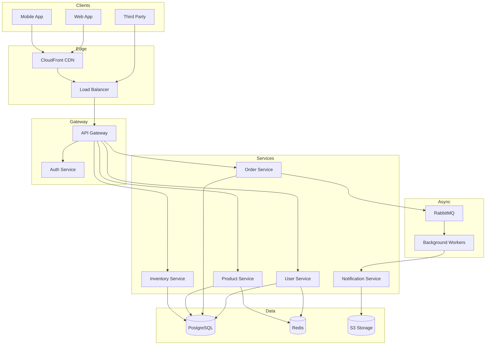

This document describes the high-level architecture of our platform.

## Overview

The system follows a microservices architecture with the following key components:

- **API Gateway**: Routes requests, handles auth, rate limiting
- **Core Services**: User, Order, Product, Inventory
- **Data Layer**: PostgreSQL (primary), Redis (cache), S3 (files)
- **Message Queue**: RabbitMQ for async processing

## Architecture Diagram

## Key Design Decisions

| Decision | Rationale |
|----------|-----------|
| PostgreSQL | ACID compliance, complex queries, JSON support |
| Redis | Sub-ms latency for hot data, session storage |
| RabbitMQ | Reliable async processing, dead letter queues |
| Microservices | Independent scaling, team autonomy |

## Scaling Strategy

1. **Horizontal scaling**: Services are stateless, scale via replicas
2. **Database**: Read replicas for queries, connection pooling
3. **Caching**: Multi-tier (CDN → Redis → DB)
4. **Async**: Offload heavy work to background workers
