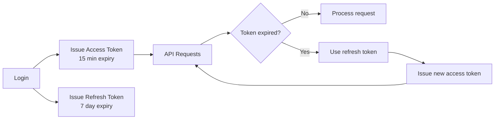

## Context

We need to implement authentication for our REST API. The system must support:
- Stateless authentication for horizontal scaling
- Mobile and web clients
- Third-party API access
- Token refresh without re-login

## Options Considered

### Option 1: Session-based (server-side)
- **Pros**: Simple, easy revocation, familiar pattern
- **Cons**: Requires session storage, doesn't scale horizontally without shared storage

### Option 2: JWT (JSON Web Tokens)
- **Pros**: Stateless, self-contained, works across services
- **Cons**: Can't revoke individual tokens, larger payload

### Option 3: OAuth 2.0 with opaque tokens
- **Pros**: Industry standard, good for third-party access
- **Cons**: Requires token introspection, added complexity

## Decision

**Use JWT with short-lived access tokens and refresh tokens.**

## Implementation Details

- Access tokens: 15-minute expiry, contains user ID and roles
- Refresh tokens: 7-day expiry, stored in httpOnly cookie
- Token blacklist in Redis for logout/revocation
- RS256 signing for token verification across services

## Consequences

- Services can verify tokens independently
- Must implement token refresh logic in clients
- Need Redis for blacklist (acceptable trade-off)
