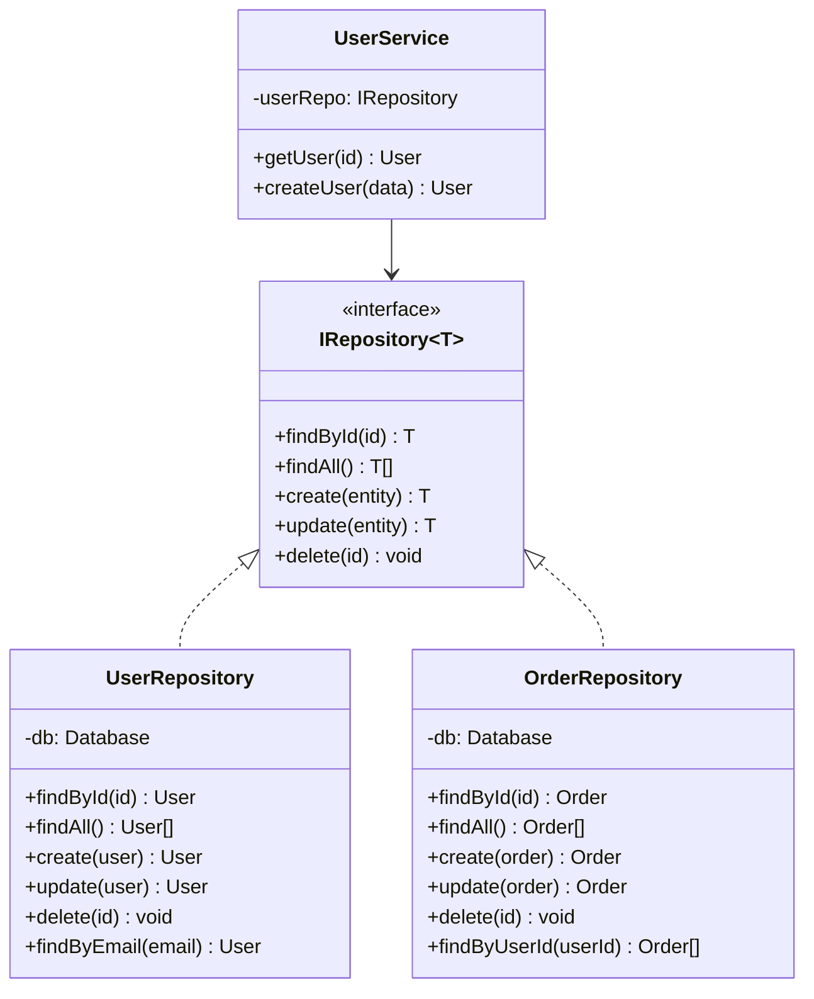

## Intent

Abstract data access logic behind a collection-like interface, decoupling business logic from database implementation details.

## Structure



## When to Use

- Multiple data sources (SQL, NoSQL, APIs)
- Complex query logic that shouldn't leak into services
- Need to mock data access for testing
- Domain model differs from database schema

## Implementation Example

```typescript
// Interface
interface IUserRepository {
  findById(id: string): Promise<User | null>;
  findByEmail(email: string): Promise<User | null>;
  create(data: CreateUserDTO): Promise<User>;
  update(id: string, data: UpdateUserDTO): Promise<User>;
  delete(id: string): Promise<void>;
}

// Implementation
class PostgresUserRepository implements IUserRepository {
  constructor(private db: Pool) {}

  async findById(id: string): Promise<User | null> {
    const result = await this.db.query(
      'SELECT * FROM users WHERE id = $1',
      [id]
    );
    return result.rows[0] ?? null;
  }

  // ... other methods
}

// Usage in service
class UserService {
  constructor(private userRepo: IUserRepository) {}

  async getUser(id: string): Promise<User> {
    const user = await this.userRepo.findById(id);
    if (!user) throw new NotFoundError('User not found');
    return user;
  }
}
```

## Benefits

1. **Testability**: Easy to mock repositories in unit tests
2. **Flexibility**: Swap implementations without changing business logic
3. **Single Responsibility**: Data access concerns isolated
4. **Consistency**: Uniform interface across different entities
