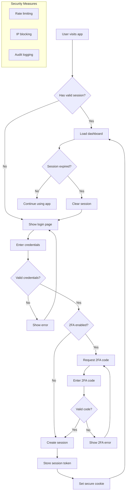

```mermaid
flowchart TD
    A[User visits app] --> B{Has valid session?}
    B -->|Yes| C[Load dashboard]
    B -->|No| D[Show login page]

    D --> E[Enter credentials]
    E --> F{Valid credentials?}
    F -->|No| G[Show error]
    G --> D

    F -->|Yes| H{2FA enabled?}
    H -->|No| I[Create session]
    H -->|Yes| J[Request 2FA code]

    J --> K[Enter 2FA code]
    K --> L{Valid code?}
    L -->|No| M[Show 2FA error]
    M --> J
    L -->|Yes| I

    I --> N[Store session token]
    N --> O[Set secure cookie]
    O --> C

    C --> P{Session expired?}
    P -->|Yes| Q[Clear session]
    Q --> D
    P -->|No| R[Continue using app]

    subgraph Security Measures
        S[Rate limiting]
        T[IP blocking]
        U[Audit logging]
    end
```
