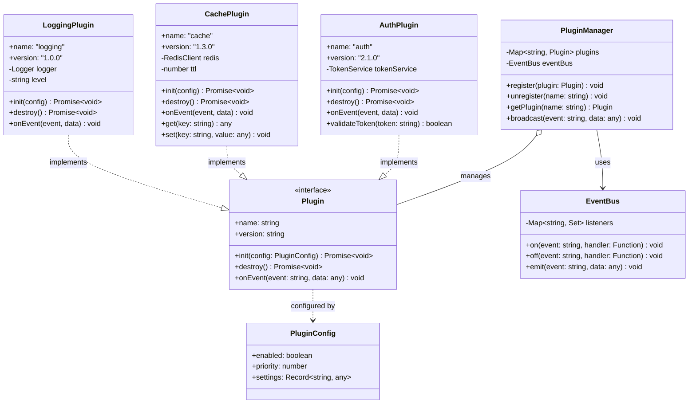

```mermaid
classDiagram
    class PluginManager {
        -Map~string, Plugin~ plugins
        -EventBus eventBus
        +register(plugin: Plugin) void
        +unregister(name: string) void
        +getPlugin(name: string) Plugin
        +broadcast(event: string, data: any) void
    }

    class Plugin {
        <<interface>>
        +name: string
        +version: string
        +init(config: PluginConfig) Promise~void~
        +destroy() Promise~void~
        +onEvent(event: string, data: any) void
    }

    class PluginConfig {
        +enabled: boolean
        +priority: number
        +settings: Record~string, any~
    }

    class EventBus {
        -Map~string, Set~ listeners
        +on(event: string, handler: Function) void
        +off(event: string, handler: Function) void
        +emit(event: string, data: any) void
    }

    class AuthPlugin {
        +name: "auth"
        +version: "2.1.0"
        -TokenService tokenService
        +init(config) Promise~void~
        +destroy() Promise~void~
        +onEvent(event, data) void
        +validateToken(token: string) boolean
    }

    class CachePlugin {
        +name: "cache"
        +version: "1.3.0"
        -RedisClient redis
        -number ttl
        +init(config) Promise~void~
        +destroy() Promise~void~
        +onEvent(event, data) void
        +get(key: string) any
        +set(key: string, value: any) void
    }

    class LoggingPlugin {
        +name: "logging"
        +version: "1.0.0"
        -Logger logger
        -string level
        +init(config) Promise~void~
        +destroy() Promise~void~
        +onEvent(event, data) void
    }

    PluginManager --> EventBus : uses
    PluginManager o-- Plugin : manages
    Plugin ..> PluginConfig : configured by
    AuthPlugin ..|> Plugin : implements
    CachePlugin ..|> Plugin : implements
    LoggingPlugin ..|> Plugin : implements
```
