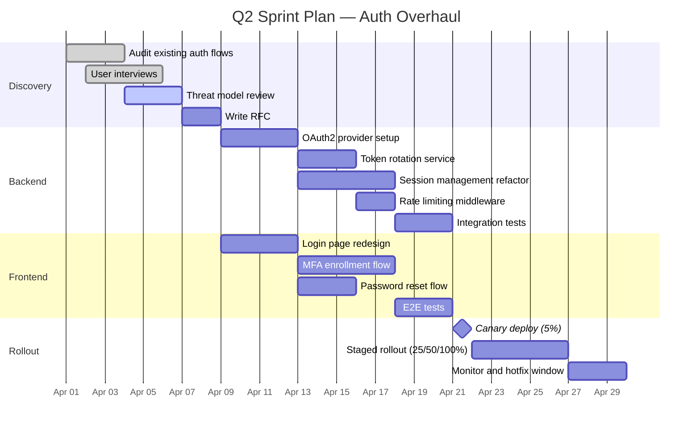

```mermaid
gantt
    title Q2 Sprint Plan — Auth Overhaul
    dateFormat YYYY-MM-DD
    axisFormat %b %d

    section Discovery
        Audit existing auth flows        :done, audit, 2026-04-01, 3d
        User interviews                  :done, interviews, 2026-04-02, 4d
        Threat model review              :active, threat, 2026-04-04, 3d
        Write RFC                        :rfc, after threat, 2d

    section Backend
        OAuth2 provider setup            :oauth, after rfc, 4d
        Token rotation service           :tokens, after oauth, 3d
        Session management refactor      :sessions, after oauth, 5d
        Rate limiting middleware          :ratelimit, after tokens, 2d
        Integration tests                :backend-tests, after sessions, 3d

    section Frontend
        Login page redesign              :login, after rfc, 4d
        MFA enrollment flow              :mfa, after login, 5d
        Password reset flow              :reset, after login, 3d
        E2E tests                        :fe-tests, after mfa, 3d

    section Rollout
        Canary deploy (5%)               :milestone, canary, after backend-tests, 1d
        Staged rollout (25/50/100%)      :rollout, after canary, 5d
        Monitor and hotfix window        :monitor, after rollout, 3d
```
