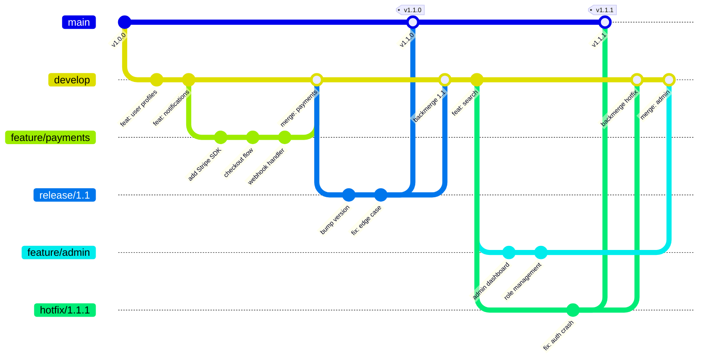

```mermaid
gitGraph
    commit id: "v1.0.0"
    branch develop
    checkout develop
    commit id: "feat: user profiles"
    commit id: "feat: notifications"
    branch feature/payments
    checkout feature/payments
    commit id: "add Stripe SDK"
    commit id: "checkout flow"
    commit id: "webhook handler"
    checkout develop
    merge feature/payments id: "merge: payments"
    branch release/1.1
    checkout release/1.1
    commit id: "bump version"
    commit id: "fix: edge case"
    checkout main
    merge release/1.1 id: "v1.1.0" tag: "v1.1.0"
    checkout develop
    merge release/1.1 id: "backmerge 1.1"
    commit id: "feat: search"
    branch feature/admin
    checkout feature/admin
    commit id: "admin dashboard"
    commit id: "role management"
    checkout develop
    branch hotfix/1.1.1
    checkout hotfix/1.1.1
    commit id: "fix: auth crash"
    checkout main
    merge hotfix/1.1.1 id: "v1.1.1" tag: "v1.1.1"
    checkout develop
    merge hotfix/1.1.1 id: "backmerge hotfix"
    merge feature/admin id: "merge: admin"
```
