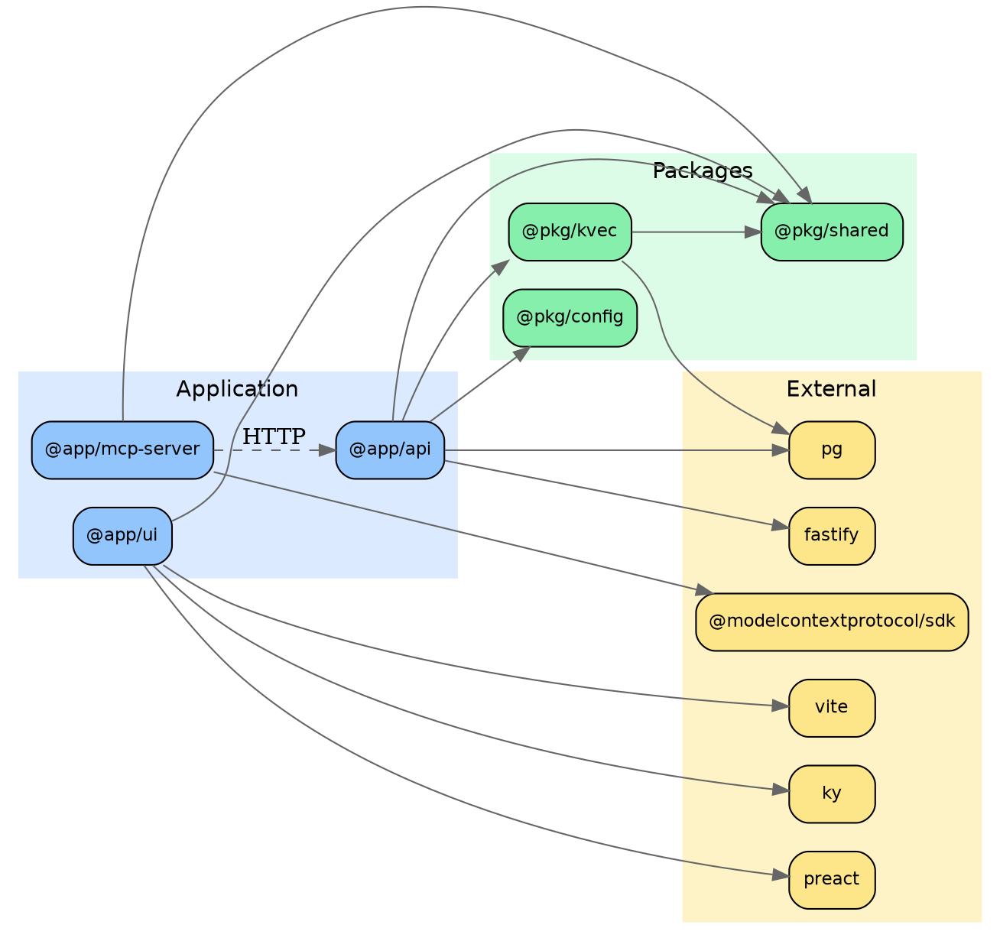

```graphviz
digraph dependencies {
    rankdir=LR
    node [shape=box, style="rounded,filled", fontname="Helvetica", fontsize=11]
    edge [color="#666666"]

    // App layer
    subgraph cluster_app {
        label="Application"
        style=filled
        color="#dbeafe"
        fontname="Helvetica"
        api [label="@app/api", fillcolor="#93c5fd"]
        ui [label="@app/ui", fillcolor="#93c5fd"]
        mcp [label="@app/mcp-server", fillcolor="#93c5fd"]
    }

    // Shared packages
    subgraph cluster_packages {
        label="Packages"
        style=filled
        color="#dcfce7"
        fontname="Helvetica"
        kvec [label="@pkg/kvec", fillcolor="#86efac"]
        shared [label="@pkg/shared", fillcolor="#86efac"]
        config [label="@pkg/config", fillcolor="#86efac"]
    }

    // External deps
    subgraph cluster_external {
        label="External"
        style=filled
        color="#fef3c7"
        fontname="Helvetica"
        fastify [label="fastify", fillcolor="#fde68a"]
        pg [label="pg", fillcolor="#fde68a"]
        preact [label="preact", fillcolor="#fde68a"]
        vite [label="vite", fillcolor="#fde68a"]
        ky [label="ky", fillcolor="#fde68a"]
        mcp_sdk [label="@modelcontextprotocol/sdk", fillcolor="#fde68a"]
    }

    // Edges
    api -> fastify
    api -> pg
    api -> shared
    api -> config
    api -> kvec

    ui -> preact
    ui -> vite
    ui -> ky
    ui -> shared

    mcp -> mcp_sdk
    mcp -> shared
    mcp -> api [style=dashed, label="HTTP"]

    kvec -> pg
    kvec -> shared
}
```
