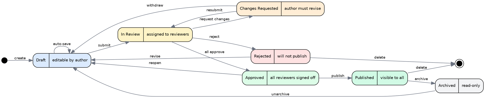

```graphviz
digraph review_states {
    rankdir=LR
    node [shape=Mrecord, style="filled", fontname="Helvetica", fontsize=10]
    edge [fontname="Helvetica", fontsize=9, color="#6B7280"]

    start [shape=point, width=0.2, fillcolor="#000000"]
    endstate [shape=doublecircle, label="", width=0.2, fillcolor="#000000"]

    draft [label="{Draft|editable by author}", fillcolor="#DBEAFE"]
    review [label="{In Review|assigned to reviewers}", fillcolor="#FEF3C7"]
    changes [label="{Changes Requested|author must revise}", fillcolor="#FFEDD5"]
    approved [label="{Approved|all reviewers signed off}", fillcolor="#DCFCE7"]
    published [label="{Published|visible to all}", fillcolor="#D1FAE5"]
    archived [label="{Archived|read-only}", fillcolor="#F3F4F6"]
    rejected [label="{Rejected|will not publish}", fillcolor="#FEE2E2"]

    start -> draft [label="create"]
    draft -> review [label="submit"]
    draft -> draft [label="auto-save"]
    review -> approved [label="all approve"]
    review -> changes [label="request changes"]
    review -> rejected [label="reject"]
    changes -> review [label="resubmit"]
    changes -> draft [label="withdraw"]
    approved -> published [label="publish"]
    approved -> draft [label="reopen"]
    published -> archived [label="archive"]
    archived -> draft [label="unarchive"]
    rejected -> draft [label="revise"]
    published -> endstate [label="delete"]
    rejected -> endstate [label="delete"]
}
```
