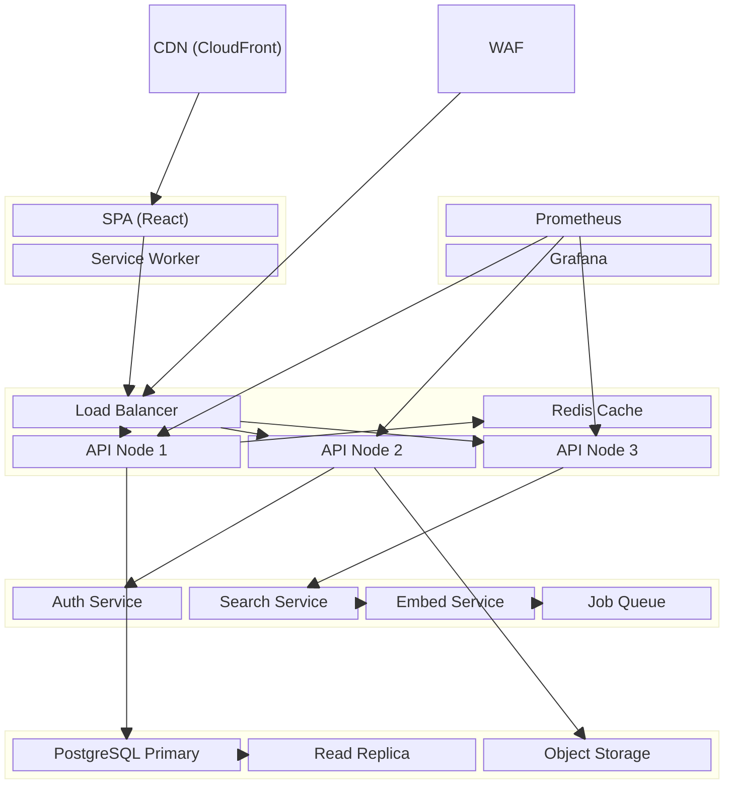

```mermaid
block-beta
    columns 5

    space cdn["CDN (CloudFront)"] space waf["WAF"] space

    space:5

    block:frontend:2
        columns 1
        spa["SPA (React)"]
        sw["Service Worker"]
    end
    space
    block:monitoring:2
        columns 1
        prom["Prometheus"]
        grafana["Grafana"]
    end

    space:5

    block:api_layer:5
        columns 3
        lb["Load Balancer"]
        space
        cache["Redis Cache"]
        api1["API Node 1"]
        api2["API Node 2"]
        api3["API Node 3"]
    end

    space:5

    block:services:5
        columns 4
        auth["Auth Service"]
        search["Search Service"]
        embed["Embed Service"]
        queue["Job Queue"]
    end

    space:5

    block:data:5
        columns 3
        pg_primary["PostgreSQL Primary"]
        pg_replica["Read Replica"]
        s3["Object Storage"]
    end

    cdn --> spa
    waf --> lb
    spa --> lb
    lb --> api1
    lb --> api2
    lb --> api3
    api1 --> cache
    api2 --> auth
    api3 --> search
    search --> embed
    embed --> queue
    api1 --> pg_primary
    pg_primary --> pg_replica
    api2 --> s3
    prom --> api1
    prom --> api2
    prom --> api3
```
