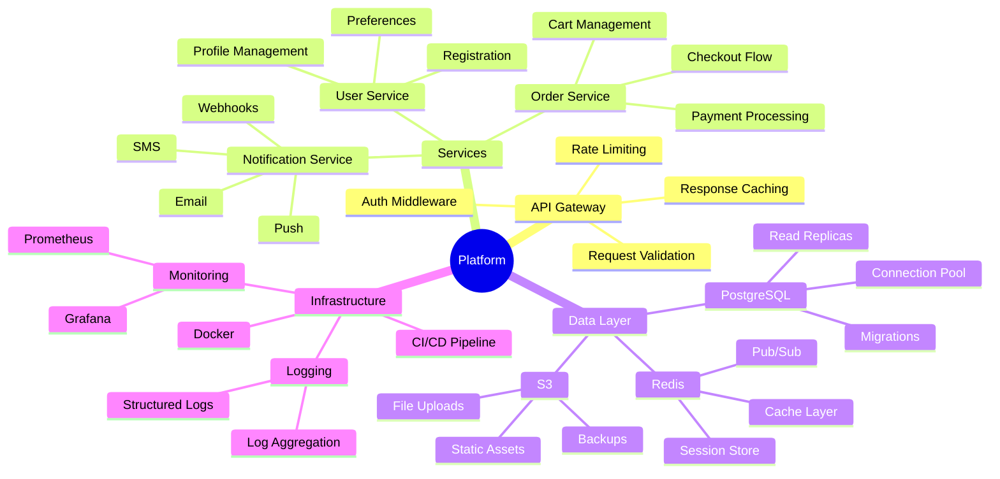

```mermaid
mindmap
    root((Platform))
        API Gateway
            Rate Limiting
            Auth Middleware
            Request Validation
            Response Caching
        Services
            User Service
                Registration
                Profile Management
                Preferences
            Order Service
                Cart Management
                Checkout Flow
                Payment Processing
            Notification Service
                Email
                Push
                SMS
                Webhooks
        Data Layer
            PostgreSQL
                Migrations
                Connection Pool
                Read Replicas
            Redis
                Session Store
                Cache Layer
                Pub/Sub
            S3
                File Uploads
                Backups
                Static Assets
        Infrastructure
            Docker
            CI/CD Pipeline
            Monitoring
                Prometheus
                Grafana
            Logging
                Structured Logs
                Log Aggregation
```
