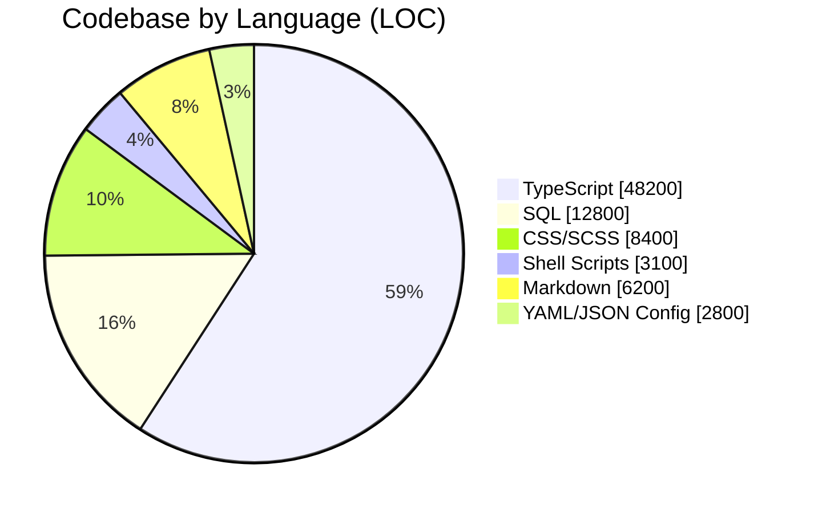

```mermaid
pie showData
    title Codebase by Language (LOC)
    "TypeScript" : 48200
    "SQL" : 12800
    "CSS/SCSS" : 8400
    "Shell Scripts" : 3100
    "Markdown" : 6200
    "YAML/JSON Config" : 2800
```
