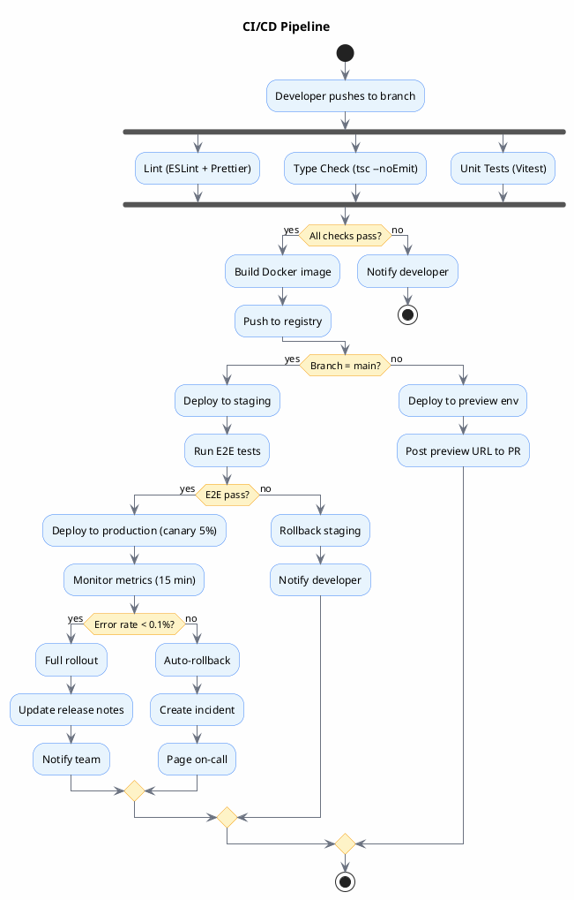

```plantuml
@startuml
skinparam backgroundColor #FEFEFE
skinparam activityBackgroundColor #E8F4FD
skinparam activityBorderColor #3B82F6
skinparam activityDiamondBackgroundColor #FEF3C7
skinparam activityDiamondBorderColor #F59E0B
skinparam arrowColor #6B7280

title CI/CD Pipeline

start

:Developer pushes to branch;

fork
  :Lint (ESLint + Prettier);
fork again
  :Type Check (tsc --noEmit);
fork again
  :Unit Tests (Vitest);
end fork

if (All checks pass?) then (yes)
  :Build Docker image;
  :Push to registry;
else (no)
  :Notify developer;
  stop
endif

if (Branch = main?) then (yes)
  :Deploy to staging;
  :Run E2E tests;

  if (E2E pass?) then (yes)
    :Deploy to production (canary 5%);
    :Monitor metrics (15 min);

    if (Error rate < 0.1%?) then (yes)
      :Full rollout;
      :Update release notes;
      :Notify team;
    else (no)
      :Auto-rollback;
      :Create incident;
      :Page on-call;
    endif
  else (no)
    :Rollback staging;
    :Notify developer;
  endif
else (no)
  :Deploy to preview env;
  :Post preview URL to PR;
endif

stop
@enduml
```
