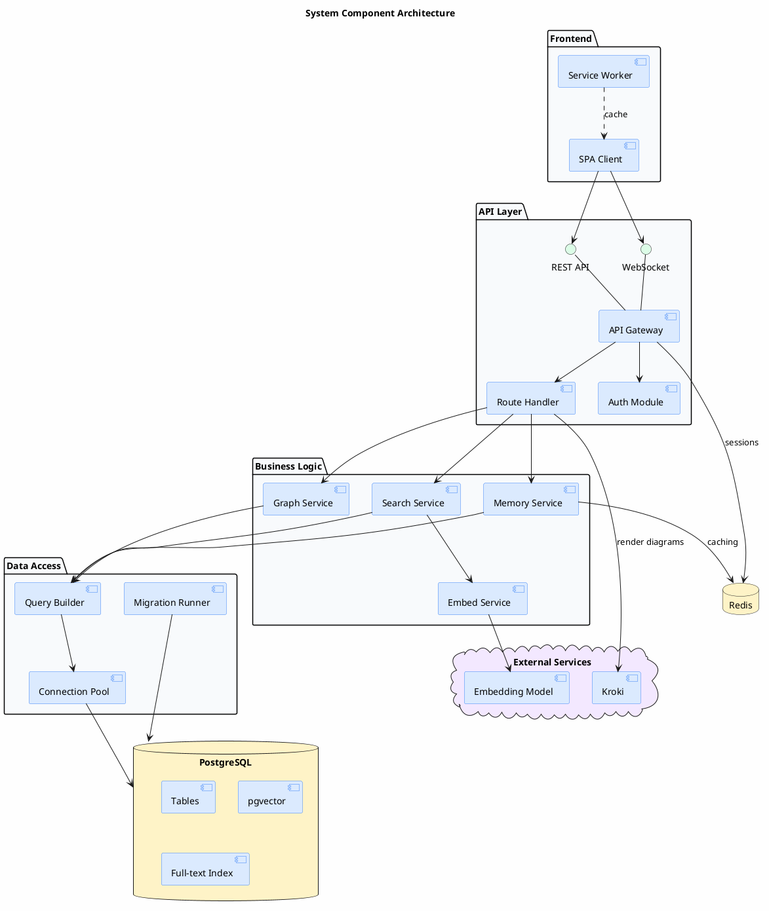

```plantuml
@startuml
skinparam backgroundColor #FEFEFE
skinparam componentBackgroundColor #DBEAFE
skinparam componentBorderColor #3B82F6
skinparam packageBackgroundColor #F8FAFC
skinparam databaseBackgroundColor #FEF3C7
skinparam cloudBackgroundColor #F3E8FF
skinparam interfaceBackgroundColor #DCFCE7

title System Component Architecture

package "Frontend" {
    [SPA Client] as spa
    [Service Worker] as sw
}

package "API Layer" {
    interface "REST API" as rest
    interface "WebSocket" as ws
    [API Gateway] as gw
    [Auth Module] as auth
    [Route Handler] as routes
}

package "Business Logic" {
    [Memory Service] as mem_svc
    [Search Service] as search_svc
    [Graph Service] as graph_svc
    [Embed Service] as embed_svc
}

package "Data Access" {
    [Query Builder] as qb
    [Connection Pool] as pool
    [Migration Runner] as migrate
}

database "PostgreSQL" as pg {
    [Tables]
    [pgvector]
    [Full-text Index]
}

database "Redis" as redis

cloud "External Services" {
    [Kroki] as kroki
    [Embedding Model] as embedder
}

spa --> rest
spa --> ws
sw ..> spa : cache

gw --> auth
gw --> routes
rest -- gw
ws -- gw

routes --> mem_svc
routes --> search_svc
routes --> graph_svc

mem_svc --> qb
search_svc --> qb
search_svc --> embed_svc
graph_svc --> qb

embed_svc --> embedder

qb --> pool
pool --> pg
migrate --> pg

mem_svc --> redis : caching
gw --> redis : sessions

routes --> kroki : render diagrams
@enduml
```
