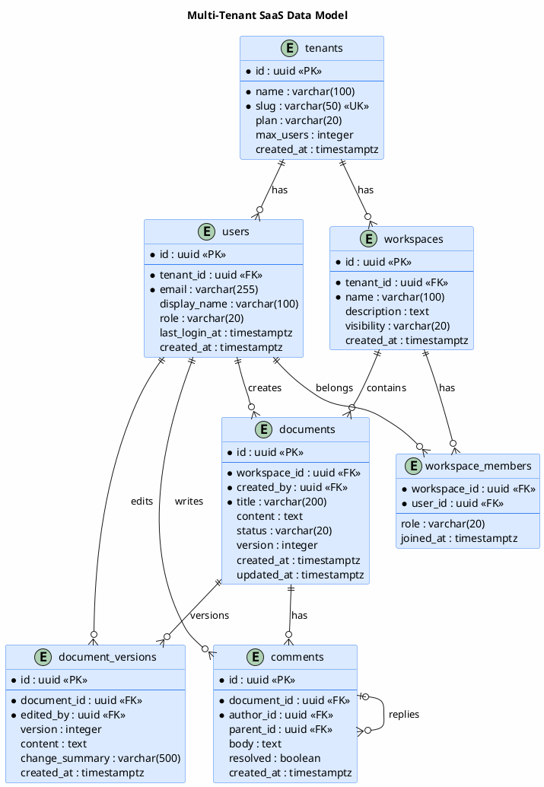

```plantuml
@startuml
skinparam backgroundColor #FEFEFE
skinparam classBackgroundColor #DBEAFE
skinparam classBorderColor #3B82F6

title Multi-Tenant SaaS Data Model

entity "tenants" as tenant {
    * id : uuid <<PK>>
    --
    * name : varchar(100)
    * slug : varchar(50) <<UK>>
    plan : varchar(20)
    max_users : integer
    created_at : timestamptz
}

entity "users" as user {
    * id : uuid <<PK>>
    --
    * tenant_id : uuid <<FK>>
    * email : varchar(255)
    display_name : varchar(100)
    role : varchar(20)
    last_login_at : timestamptz
    created_at : timestamptz
}

entity "workspaces" as workspace {
    * id : uuid <<PK>>
    --
    * tenant_id : uuid <<FK>>
    * name : varchar(100)
    description : text
    visibility : varchar(20)
    created_at : timestamptz
}

entity "workspace_members" as ws_member {
    * workspace_id : uuid <<FK>>
    * user_id : uuid <<FK>>
    --
    role : varchar(20)
    joined_at : timestamptz
}

entity "documents" as doc {
    * id : uuid <<PK>>
    --
    * workspace_id : uuid <<FK>>
    * created_by : uuid <<FK>>
    * title : varchar(200)
    content : text
    status : varchar(20)
    version : integer
    created_at : timestamptz
    updated_at : timestamptz
}

entity "document_versions" as doc_ver {
    * id : uuid <<PK>>
    --
    * document_id : uuid <<FK>>
    * edited_by : uuid <<FK>>
    version : integer
    content : text
    change_summary : varchar(500)
    created_at : timestamptz
}

entity "comments" as comment {
    * id : uuid <<PK>>
    --
    * document_id : uuid <<FK>>
    * author_id : uuid <<FK>>
    parent_id : uuid <<FK>>
    body : text
    resolved : boolean
    created_at : timestamptz
}

tenant ||--o{ user : has
tenant ||--o{ workspace : has
workspace ||--o{ ws_member : has
user ||--o{ ws_member : belongs
workspace ||--o{ doc : contains
user ||--o{ doc : creates
doc ||--o{ doc_ver : versions
doc ||--o{ comment : has
user ||--o{ comment : writes
comment |o--o{ comment : replies
user ||--o{ doc_ver : edits
@enduml
```
