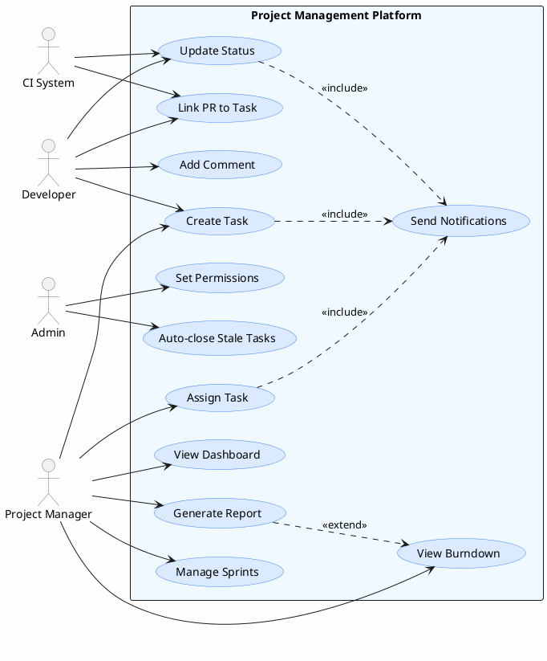

```plantuml
@startuml
skinparam backgroundColor #FEFEFE
skinparam packageBackgroundColor #F0F9FF
skinparam usecaseBackgroundColor #DBEAFE
skinparam usecaseBorderColor #3B82F6
skinparam actorBorderColor #6B7280

left to right direction

actor "Developer" as dev
actor "Project Manager" as pm
actor "Admin" as admin
actor "CI System" as ci

rectangle "Project Management Platform" {
    usecase "Create Task" as UC1
    usecase "Assign Task" as UC2
    usecase "Update Status" as UC3
    usecase "Add Comment" as UC4
    usecase "View Dashboard" as UC5
    usecase "Generate Report" as UC6
    usecase "Manage Sprints" as UC7
    usecase "Set Permissions" as UC8
    usecase "Auto-close Stale Tasks" as UC9
    usecase "Link PR to Task" as UC10
    usecase "Send Notifications" as UC11
    usecase "View Burndown" as UC12
}

dev --> UC1
dev --> UC3
dev --> UC4
dev --> UC10

pm --> UC1
pm --> UC2
pm --> UC5
pm --> UC6
pm --> UC7
pm --> UC12

admin --> UC8
admin --> UC9

ci --> UC10
ci --> UC3

UC1 ..> UC11 : <<include>>
UC2 ..> UC11 : <<include>>
UC3 ..> UC11 : <<include>>
UC6 ..> UC12 : <<extend>>
@enduml
```
