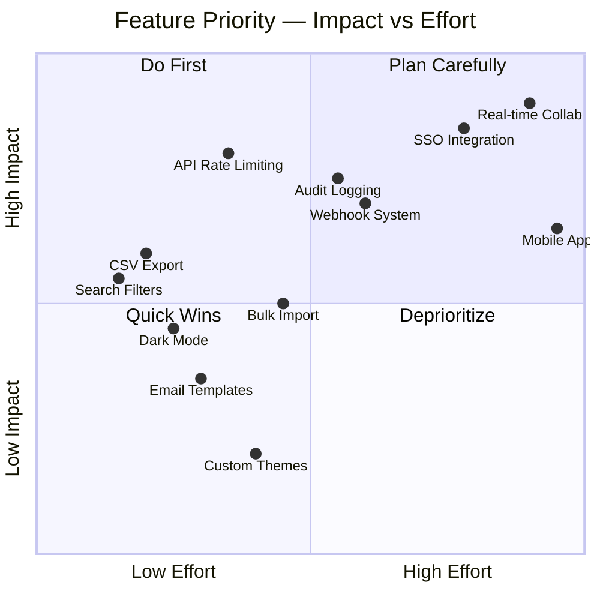

```mermaid
quadrantChart
    title Feature Priority — Impact vs Effort
    x-axis Low Effort --> High Effort
    y-axis Low Impact --> High Impact
    quadrant-1 Plan Carefully
    quadrant-2 Do First
    quadrant-3 Quick Wins
    quadrant-4 Deprioritize
    SSO Integration: [0.78, 0.85]
    Dark Mode: [0.25, 0.45]
    API Rate Limiting: [0.35, 0.80]
    CSV Export: [0.20, 0.60]
    Real-time Collab: [0.90, 0.90]
    Email Templates: [0.30, 0.35]
    Audit Logging: [0.55, 0.75]
    Custom Themes: [0.40, 0.20]
    Webhook System: [0.60, 0.70]
    Mobile App: [0.95, 0.65]
    Search Filters: [0.15, 0.55]
    Bulk Import: [0.45, 0.50]
```
