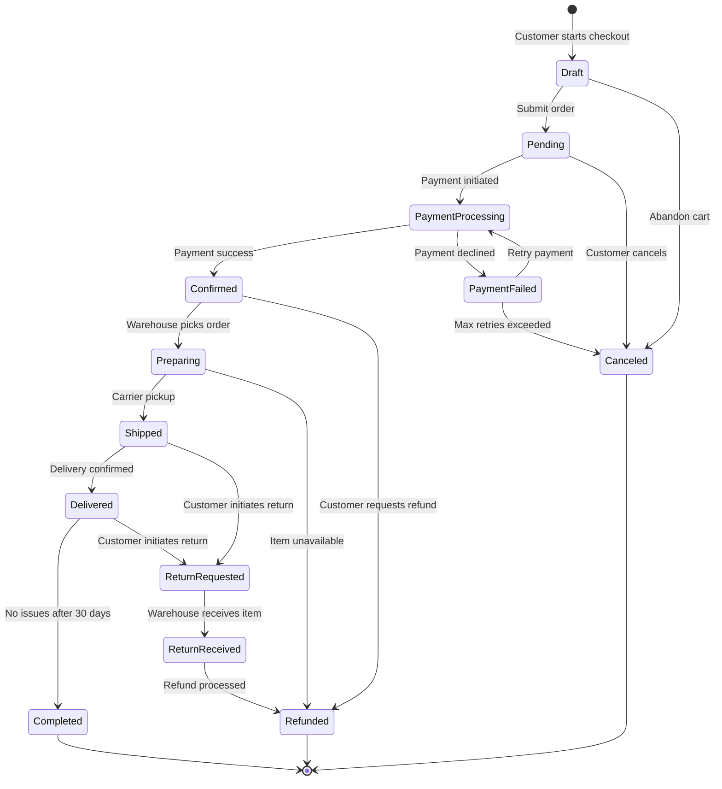

```mermaid
stateDiagram-v2
    [*] --> Draft: Customer starts checkout
    Draft --> Pending: Submit order
    Draft --> Canceled: Abandon cart

    Pending --> PaymentProcessing: Payment initiated
    Pending --> Canceled: Customer cancels

    PaymentProcessing --> Confirmed: Payment success
    PaymentProcessing --> PaymentFailed: Payment declined

    PaymentFailed --> PaymentProcessing: Retry payment
    PaymentFailed --> Canceled: Max retries exceeded

    Confirmed --> Preparing: Warehouse picks order
    Confirmed --> Refunded: Customer requests refund

    Preparing --> Shipped: Carrier pickup
    Preparing --> Refunded: Item unavailable

    Shipped --> Delivered: Delivery confirmed
    Shipped --> ReturnRequested: Customer initiates return

    Delivered --> Completed: No issues after 30 days
    Delivered --> ReturnRequested: Customer initiates return

    ReturnRequested --> ReturnReceived: Warehouse receives item
    ReturnReceived --> Refunded: Refund processed

    Refunded --> [*]
    Canceled --> [*]
    Completed --> [*]
```
