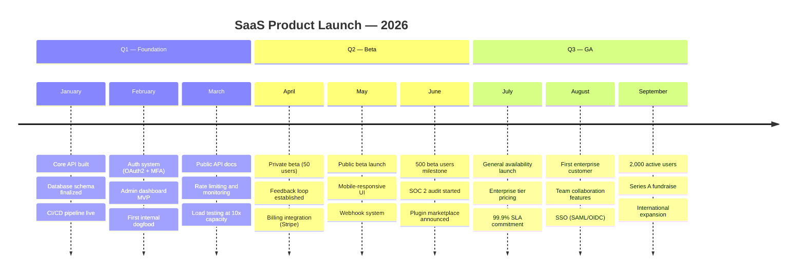

```mermaid
timeline
    title SaaS Product Launch — 2026
    section Q1 — Foundation
        January : Core API built
                : Database schema finalized
                : CI/CD pipeline live
        February : Auth system (OAuth2 + MFA)
                 : Admin dashboard MVP
                 : First internal dogfood
        March : Public API docs
              : Rate limiting and monitoring
              : Load testing at 10x capacity
    section Q2 — Beta
        April : Private beta (50 users)
              : Feedback loop established
              : Billing integration (Stripe)
        May : Public beta launch
            : Mobile-responsive UI
            : Webhook system
        June : 500 beta users milestone
             : SOC 2 audit started
             : Plugin marketplace announced
    section Q3 — GA
        July : General availability launch
             : Enterprise tier pricing
             : 99.9% SLA commitment
        August : First enterprise customer
               : Team collaboration features
               : SSO (SAML/OIDC)
        September : 2,000 active users
                  : Series A fundraise
                  : International expansion
```
