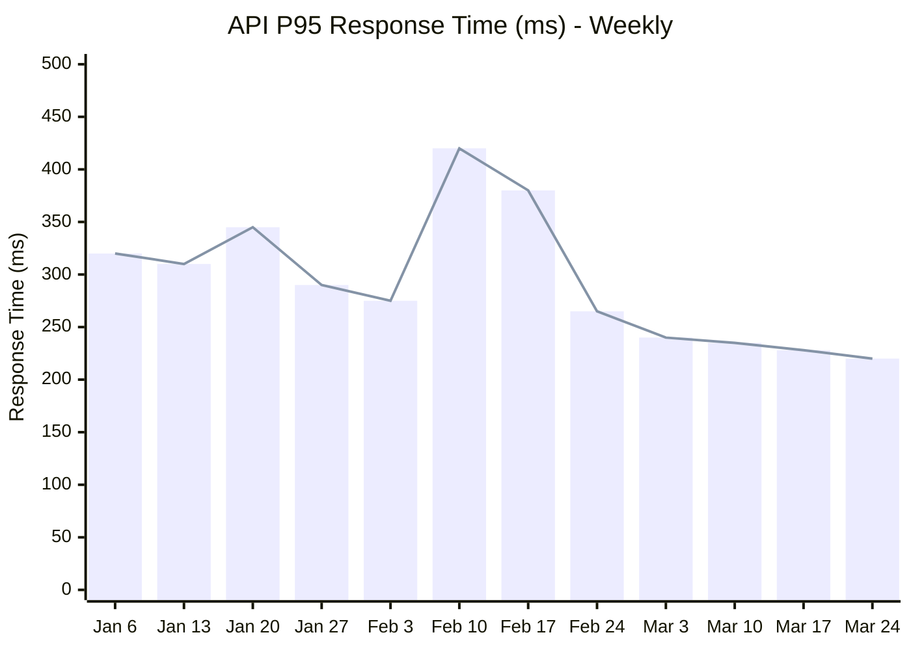

```mermaid
xychart-beta
    title "API P95 Response Time (ms) - Weekly"
    x-axis ["Jan 6", "Jan 13", "Jan 20", "Jan 27", "Feb 3", "Feb 10", "Feb 17", "Feb 24", "Mar 3", "Mar 10", "Mar 17", "Mar 24"]
    y-axis "Response Time (ms)" 0 --> 500
    bar [320, 310, 345, 290, 275, 420, 380, 265, 240, 235, 228, 220]
    line [320, 310, 345, 290, 275, 420, 380, 265, 240, 235, 228, 220]
```
