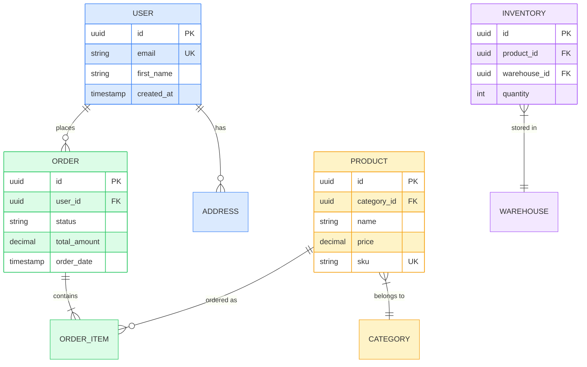
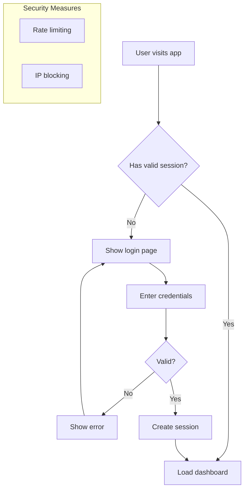
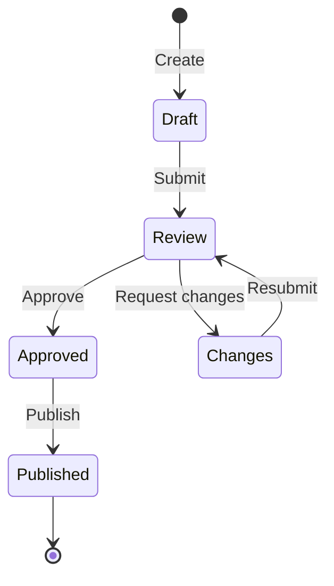
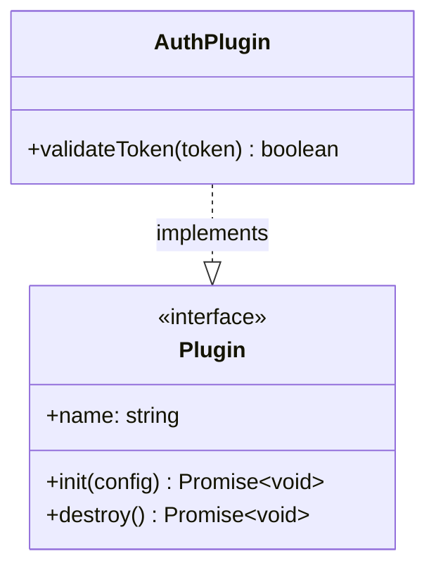
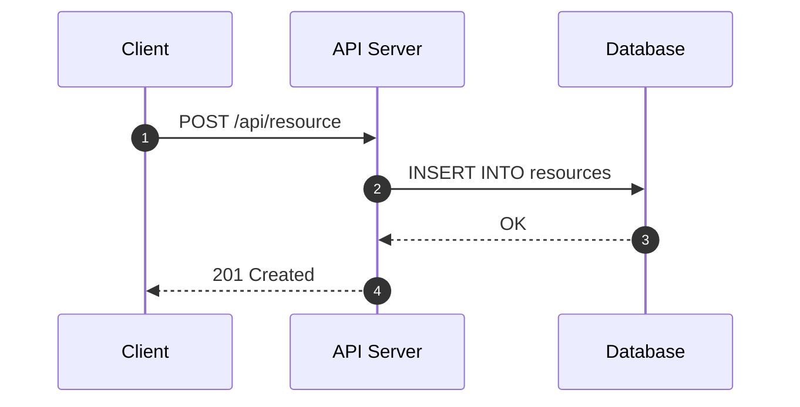
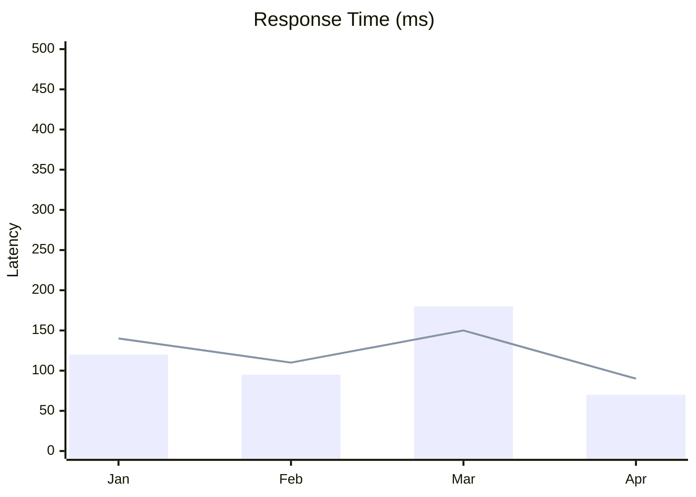
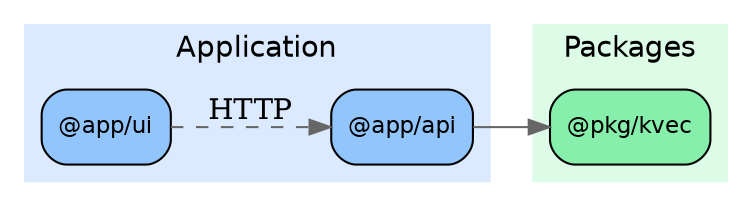
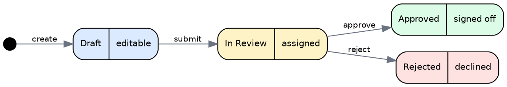
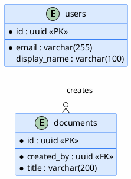
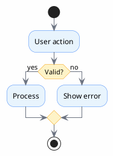

# Diagram Styling Guide

Complete reference for coloring and styling diagrams across all four supported languages.

## Mermaid

### ERD with Domain Colors



**Placement rules:**
- `classDef` lines immediately after `erDiagram`, before relationships
- `:::` class assignments after all entity attribute blocks
- Supported style properties: `fill`, `stroke`, `stroke-width`, `color`

**Annotation rules:**
- Valid column annotations: `PK`, `FK`, `UK`
- NEVER combine with hyphens (no `PK-FK`)
- Use plain `FK` for columns in junction tables even if they form a composite PK

### Flowchart with Subgraphs



- Use `flowchart` (not `graph`) for type declaration
- Reserved node IDs that need wrapping: `graph`, `subgraph`, `end`, `style`, `class`, `click`, `linkStyle`, `classDef`
- Fix: `endNode[end]` instead of bare `end`

### State Diagram



### Class Diagram



### Sequence Diagram



### XY Chart



- Always quote titles containing parentheses
- Does not support `%%{init:}%%` theme directives

## D2

### Architecture with Nested Containers

```d2
direction: right

clients: Clients {
  web: Web App {
    shape: rectangle
    style.fill: "#dbeafe"
  }
  mobile: Mobile App {
    shape: rectangle
    style.fill: "#dbeafe"
  }
}

gateway: API Gateway {
  shape: rectangle
  style.fill: "#fef3c7"
  style.stroke: "#f59e0b"
}

services: Services {
  style.fill: "#f0fdf4"

  users: User Service {
    shape: rectangle
    style.fill: "#dcfce7"
  }
  orders: Order Service {
    shape: rectangle
    style.fill: "#dcfce7"
  }
}

data: Data Stores {
  style.fill: "#fdf2f8"

  pg: PostgreSQL {
    shape: cylinder
    style.fill: "#fce7f3"
  }
  redis: Redis {
    shape: cylinder
    style.fill: "#fce7f3"
  }
}

clients.web -> gateway
clients.mobile -> gateway
gateway -> services.users
gateway -> services.orders
services.users -> data.pg
services.orders -> data.redis
```

**Key D2 styling properties:**
- `style.fill` -- background color (must quote hex values)
- `style.stroke` -- border color
- `style.font-size` -- text size (integer)
- `style.bold` -- bold text (true/false)
- `style.stroke-dash` -- dashed lines (integer, e.g., 5)
- `shape` -- rectangle, cylinder, circle, diamond, oval, hexagon, etc.

### Grid / Categorized Layout

```d2
adopt: Adopt {
  style.fill: "#dcfce7"
  style.stroke: "#22c55e"
  style.font-size: 16
  style.bold: true

  item1: TypeScript
  item2: PostgreSQL
}

trial: Trial {
  style.fill: "#dbeafe"
  style.stroke: "#3b82f6"
  style.font-size: 16
  style.bold: true

  item1: pgvector
  item2: MCP Protocol
}

adopt -> trial: evaluate {style.stroke-dash: 5}
```

## Graphviz

### Dependency Graph with Cluster Coloring



**Key Graphviz patterns:**
- `subgraph cluster_*` prefix required for grouping (the `cluster_` prefix is special)
- `color` on subgraph = background fill
- `fillcolor` on nodes = individual node fill (requires `style="filled"`)
- Global `node [...]` sets defaults for all nodes

### State Machine with Record Nodes



- `Mrecord` shape gives rounded multi-section nodes
- Use `{Title|subtitle}` syntax for multi-line record labels
- `point` shape for start/end markers

## PlantUML

### ERD with skinparam



### Activity Diagram with Themed Decisions



**Common skinparam properties:**
- `backgroundColor` -- canvas background
- `classBackgroundColor` / `classBorderColor` -- entity fills
- `activityBackgroundColor` / `activityBorderColor` -- action boxes
- `activityDiamondBackgroundColor` / `activityDiamondBorderColor` -- decision diamonds
- `arrowColor` -- connector lines
- `noteBackgroundColor` / `noteBorderColor` -- note styling
