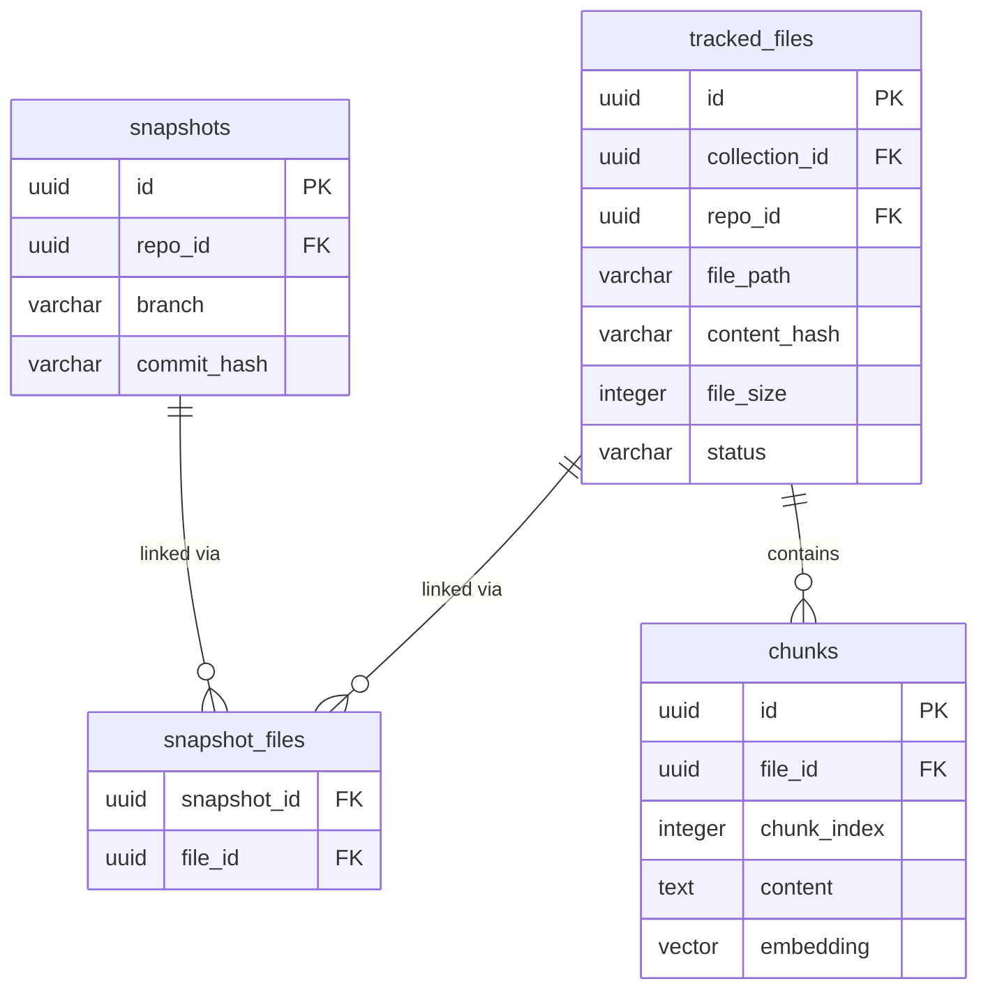

# kvec

Lightweight embeddable vector database library using [pgvector](https://github.com/pgvector/pgvector). Shares your application's PostgreSQL connection — no external vector DB needed.

kvec is a storage and ingestion library, not a standalone service. It handles chunking, embedding, and persistence but does not expose any HTTP endpoints or search APIs on its own. In the khef project, the API layer (`apps/api/`) wraps kvec with REST endpoints and MCP tools for querying. A Python sidecar process must be running to generate embeddings — kvec calls it over HTTP but does not manage its lifecycle.

## Features

- **Embedded** — runs inside your app, not as a separate service
- **pgvector** — cosine similarity search via PostgreSQL
- **Content-hash dedup** — skips re-embedding unchanged files when chunk rows already exist
- **AST-aware chunking** — tree-sitter for 35+ languages via [LlamaIndex CodeSplitter](https://docs.llamaindex.ai/en/stable/api_reference/node_parsers/code/)
- **Markdown-aware chunking** — splits on heading boundaries
- **Git-aware ingestion** — respects `.gitignore`, tracks repos/branches/commits
- **Collection-based** — isolated namespaces with independent embedding models

## Quick Start

```typescript
import { Pool } from 'pg';
import { KVec } from '@khef/kvec';

const pool = new Pool({ connectionString: process.env.DATABASE_URL });

const kvec = new KVec({
  pool,
  embedding: { provider: 'python-sidecar', serverUrl: 'http://127.0.0.1:9100' },
});

// Create a collection
const coll = await kvec.createCollection({
  name: 'my-docs',
  embeddingModel: 'all-mpnet-base-v2',
  dimensions: 768,
  storeType: 'source-code',
});

// Ingest a file (chunks, embeds, stores — skips if unchanged and already chunked)
await coll.ingest('/path/to/file.ts');

// Search
const results = await coll.query('authentication middleware', { limit: 5 });
```

## Architecture

kvec stores everything in a dedicated `kvec` schema within your PostgreSQL database:

```
kvec.collections      — named containers with embedding config
kvec.repos            — git repositories (normalized)
kvec.snapshots        — point-in-time repo state (branch + commit)
kvec.snapshot_files   — join table linking snapshots to file versions
kvec.tracked_files    — content-addressable file tracking
kvec.chunks           — vector embeddings (pgvector cosine similarity)
kvec.upload_events    — audit log of ingestion activity
```

### Content-Addressable File Tracking

Files are identified by `(collection, repo, path, content_hash)`. This means:

- **Same content, any branch/commit** — one row, shared chunks. The snapshot_files join table links it to every snapshot that contains it.
- **Different content at the same path** — separate rows with independent chunks. Each version is linked to its own snapshots.
- **Ingesting is idempotent and order-independent** — embedding branch A then B produces the same state as B then A. No overwrites, no side effects.

When a file hasn't changed between commits, `ingest()` skips chunking/embedding and just records the snapshot link (~1ms vs seconds for a full embed cycle). If a tracked file exists but has zero chunks, `ingest()` reprocesses it automatically.



Non-git content (`ingestContent()`) stays single-version — old versions are replaced on content change.

## Collections

Collections are isolated namespaces, each with their own embedding model and store type:

```typescript
// Source code (AST-aware chunking via tree-sitter)
const code = await kvec.createCollection({
  name: 'source',
  embeddingModel: 'all-mpnet-base-v2',
  dimensions: 768,
  storeType: 'source-code',
});

// Markdown (heading-aware chunking)
const docs = await kvec.createCollection({
  name: 'docs',
  embeddingModel: 'all-mpnet-base-v2',
  dimensions: 768,
  storeType: 'markdown',
});
```

## Ingestion

### Files

```typescript
// Single file
await coll.ingest('/path/to/file.py');

// With git metadata
await coll.ingest('/path/to/file.py', {
  repoName: 'my-project',
  repoRootPath: '/path/to',
  branch: 'main',
  commitHash: 'abc123',
});
```

### Directories

```typescript
import { ingestDirectory } from '@khef/kvec';

const result = await ingestDirectory(coll, '/path/to/project', {
  extensions: ['.ts', '.py', '.go'],
  verbose: true,
});
// result: { filesProcessed, filesSkipped, chunksCreated, durationMs, ... }
```

Features:
- Auto-detects git repos (uses `git ls-files`)
- Skips binary files and common non-source dirs (`node_modules`, `.git`, `dist`, etc.)
- Sorts files by size ascending (quick wins first)
- Single-line progress output

### Raw Content

For non-file documents (e.g., database records):

```typescript
await coll.ingestContent('memory-uuid-123', markdownContent, {
  language: 'markdown',
  metadata: { project_id: 'abc', type: 'context' },
});

// Delete by document ID
await coll.deleteDocument('memory-uuid-123');
```

## Querying

```typescript
// Text query (generates embedding automatically)
const results = await coll.query('how does auth work?', {
  limit: 10,
  repoName: 'my-project',
  language: 'typescript',
  branch: 'main',
  commitHash: 'abc123',
  minScore: 0.3,
});

// Pre-computed embedding
const results = await coll.queryWithEmbedding(vector, { limit: 5 });
```

**Query options:**

| Option | Type | Description |
|--------|------|-------------|
| `limit` | number | Max results (default: 10) |
| `repoName` | string | Filter by repository name |
| `language` | string | Filter by file language |
| `branch` | string | Filter by git branch (joins through snapshot_files) |
| `commitHash` | string | Filter by git commit hash (joins through snapshot_files) |
| `minScore` | number | Minimum similarity score threshold (0-1) |
| `filter` | object | JSONB containment filter on chunk metadata |

Each result includes `score`, `content`, `filePath`, `language`, `metadata`, and `chunkIndex`.

### Query Deduplication

When multiple content versions of the same file exist (from different branches or commits), queries handle dedup automatically:

- **No branch/commit filter** — only the latest version of each file is searched. Older versions are excluded via a `NOT EXISTS` check on `updated_at`.
- **Branch filter** — returns file versions linked to any snapshot on that branch via the `snapshot_files` join table.
- **Commit filter** — returns file versions linked to that exact snapshot.
- **Branch + commit** — narrows to the specific snapshot matching both.

## Embedding Providers

kvec delegates embedding generation to a configurable provider:

| Provider | Config | Description |
|----------|--------|-------------|
| `python-sidecar` | `serverUrl` | HTTP server running [sentence-transformers](https://www.sbert.net/) (default) |
| `custom` | `embedFn` | Bring your own embedding function |

### Python Sidecar Protocol

The `python-sidecar` provider expects an HTTP server implementing two endpoints:

| Endpoint | Method | Body | Response |
|----------|--------|------|----------|
| `/embed` | POST | `{"texts": ["...", "..."]}` | `{"embeddings": [[...], [...]], "dimensions": 768}` |
| `/chunk` | POST | `{"code": "...", "language": "typescript"}` | `{"chunks": [{"content": "...", "index": 0}], "method": "ast_typescript"}` |

kvec ships a reference implementation (`embed_server.py`) that uses [sentence-transformers](https://www.sbert.net/) for embeddings and [tree-sitter-language-pack](https://pypi.org/project/tree-sitter-language-pack/) for AST chunking. In the khef project, this sidecar is managed by the API server — it starts automatically with `npm run dev:api` when `VECTOR_ENABLED=true`.

### Model Lifecycle

kvec uses [sentence-transformers](https://github.com/UKPLab/sentence-transformers) to load pre-trained embedding models from [Hugging Face Hub](https://huggingface.co/).

1. **First load:** On startup, `SentenceTransformer(model_name)` downloads model weights from Hugging Face if not cached. This is a one-time download (~420 MB for `all-mpnet-base-v2`) and can take 30-60 seconds depending on network speed.

2. **Local cache:** Downloaded models are stored at `~/.cache/huggingface/hub/`. Subsequent loads read from cache with no network call.

3. **Runtime:** The model is loaded into memory once at startup and stays resident for all embedding requests. There is no per-request loading overhead. The sidecar process runs until stopped.

### Hardware Acceleration

PyTorch automatically selects the best available compute device when loading the model:

| Device | When | Notes |
|--------|------|-------|
| **MPS** (Metal Performance Shaders) | Apple Silicon Macs | GPU-accelerated, no fan spin for small models |
| **CUDA** | NVIDIA GPU with CUDA toolkit | Standard GPU acceleration |
| **CPU** | Fallback | Works everywhere, significantly slower |

The sidecar does not explicitly set a device — `SentenceTransformer(model_name)` delegates to PyTorch's default device selection. On Apple Silicon this means embeddings run on the GPU via Metal with no additional configuration.

To force CPU (e.g., if MPS causes issues), set `CUDA_VISIBLE_DEVICES=""` before starting the sidecar.

### Default Model

| Property | Value |
|----------|-------|
| Name | [all-mpnet-base-v2](https://huggingface.co/sentence-transformers/all-mpnet-base-v2) |
| Dimensions | 768 |
| Max tokens | 384 |
| Similarity | Cosine |
| Size on disk | ~420 MB |
| Cache location | `~/.cache/huggingface/hub/` |

To use a different model, pass `--model <name>` to the sidecar and create collections with matching `dimensions`.

### Why all-mpnet-base-v2

This model was selected under strict constraints: local-only (no API dependencies), U.S.-created, 768 dimensions, and retrieval-tuned for cosine similarity search.

**Benchmarked against `microsoft/unixcoder-base`** on 173K+ source code chunks — `all-mpnet-base-v2` scored 4x higher on retrieval quality (0.59 vs 0.15 avg similarity). `unixcoder-base` is designed for code understanding tasks (clone detection, completion) rather than similarity search, so its embeddings don't cluster meaningfully for retrieval.

**Other candidates eliminated:**

| Model | Why eliminated |
|-------|---------------|
| Voyage `code-3` | API dependency |
| OpenAI `text-embedding-3-large` | API dependency |
| `jinaai/jina-embeddings-v2-base-code` | Non-U.S. origin (Germany) |
| `microsoft/unixcoder-base` | Not retrieval-tuned (benchmark confirmed) |
| `microsoft/codebert-base` | Not retrieval-tuned |

**Why a general-purpose model works for code:** 90%+ of searches are conceptual ("auth middleware", "retry logic") rather than structural ("function accepting two generics"). AST-aware chunking via tree-sitter provides clean function boundaries with signatures and names that give the model strong natural language signals even in pure code.

## Chunking Strategies

Chunker selection is automatic based on collection `storeType`:

| Store Type | Chunker | Method |
|------------|---------|--------|
| `source-code` | `ASTSidecarChunker` | tree-sitter AST parsing (35+ languages), falls back to token-aware |
| `markdown` | `MarkdownChunker` | Splits on H1-H6 headings, preserves section structure |
| `mixed` / default | `TokenAwareChunker` | Character-ratio token estimation with overlap |

## Prerequisites

- PostgreSQL with [pgvector](https://github.com/pgvector/pgvector) extension
- Python sidecar server for embeddings (`embed_server.py` on port 9100)
- Node.js 18+

## Schema Setup

kvec manages its own schema via migrations. The schema is created in the `kvec` namespace:

```sql
CREATE SCHEMA IF NOT EXISTS kvec;
CREATE EXTENSION IF NOT EXISTS vector;
```

Migrations are managed by the host application. See `db/migrate/migrations/` for the full DDL.
